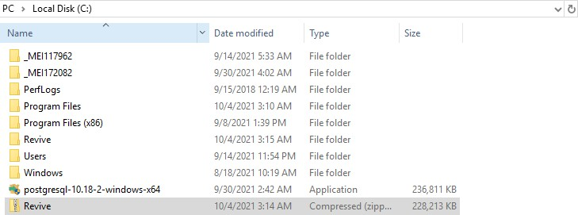
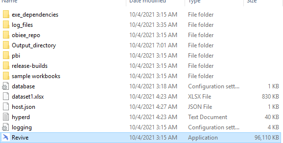

### Pre-requisites 
- PostgreSQL version 10.18 

- PostgreSQL ODBC Driver 

- Revive zip file 

- Power BI – Desktop version (To be installed only if not already available) 

- MAC Address of the device should be shared  with admin prior to getting the exe.

### Accessing Revive
- Locate :
    - Revive exe sent by admin should be placed in a dedicated folder

    - Extract the exe file into that folder.
    

- Run :
    - Open the ‘Revive’ exe from the folder
    

    - On Running the exe revive will be installed as below:
    