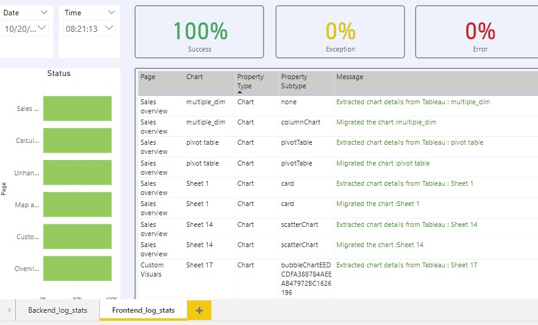
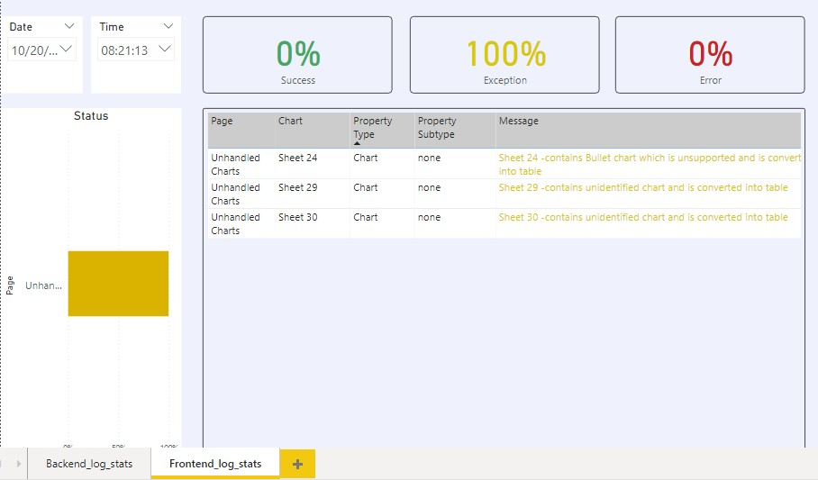
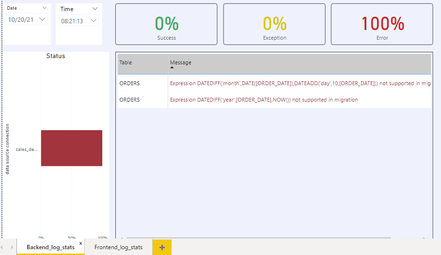

### Migration statistics (Logs) 
The statistics dashboard can be used for analysis on the overall status viz., Success, Exceptions
(converted as standard tables or unsupported visuals) and Errors (unsupported back-end aspects)
of the migrations at the Page, Chart and Property levels for all applications.

Users can drill down or roll-up for abstracted views or use the date and time filters to understand
specific migrations – for both front-end and back-end aspects.

i.) View of successfully migrated charts

ii.) View of charts migrated with Exceptions

iii.) View of charts not migrated/ migrated with errors

