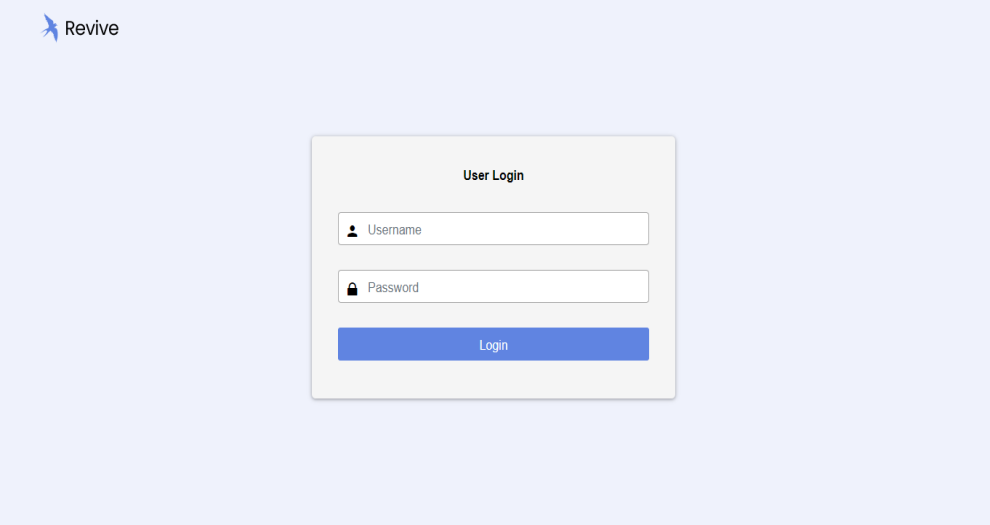
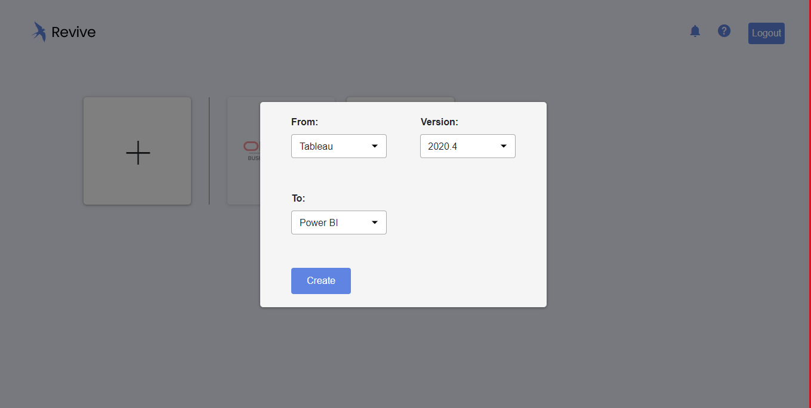
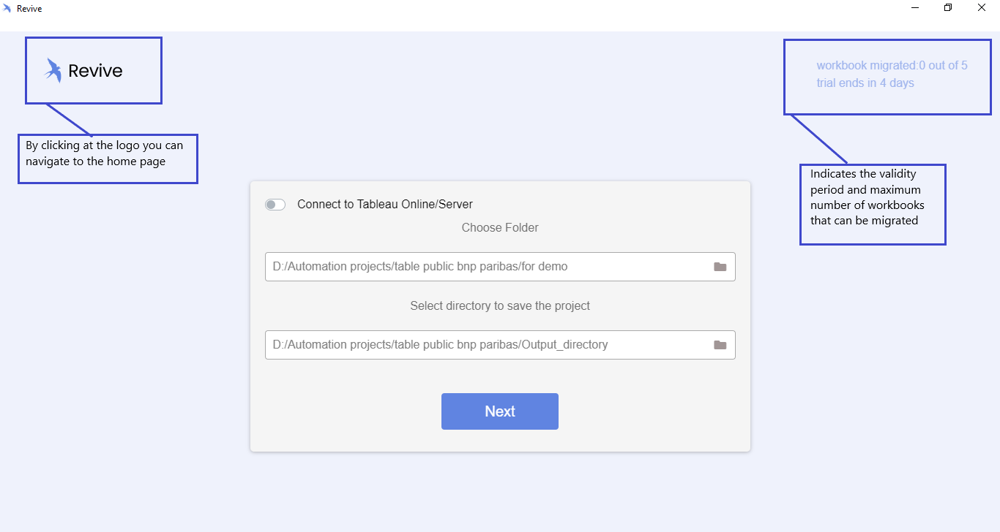
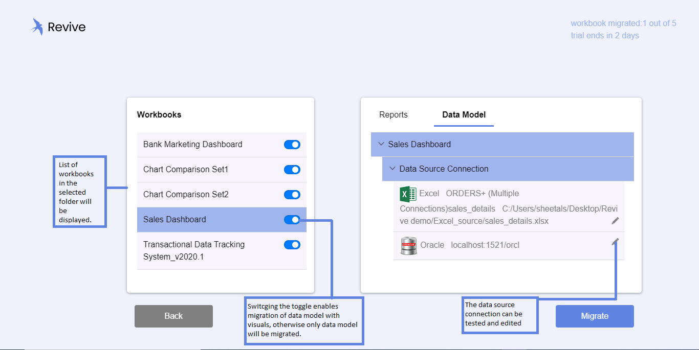
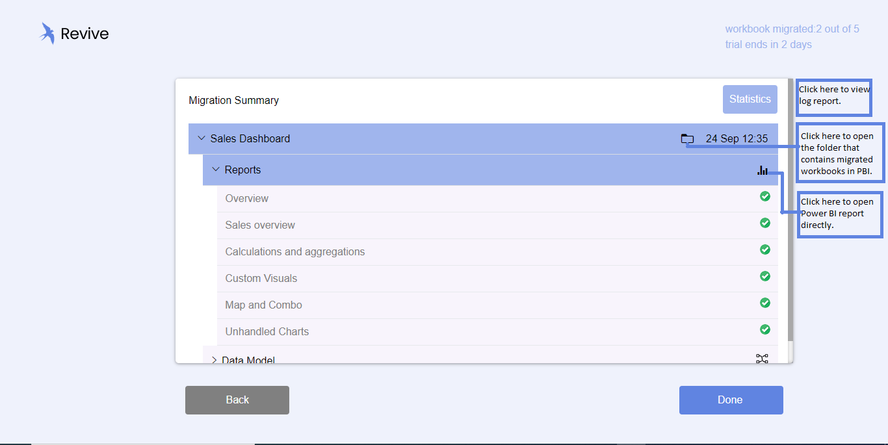

Below Steps will take you through a typical migration flow for Revive along with small tour of the product. 

### Login  
- Once the installation is complete and connection with PostgreSQL database is established, you are ready to use the software. Credentials for login will be provided by the administrator. 

 

### Home

- Upon successful login, the home page can be accessed, where the following actions can be taken:
    - ‘+’ to begin the migration process
    - “i” at the header to know pending number of days and migration runs available during
        the trial period
    - “?” for Help, covering list of supported and un-supported features and the product tour

 
### Migration
- Begin by clicking “+” or Tableau logo and select source and version, destination (in this case
Tableau and Power BI respectively) and the version. Click Create to proceed.
 

### Folder selection
- As the next step, choose the source and destination paths (folders where you store and manage files used in Revive)  
 

### Workbook selection
- All the Workbooks can be seen on the left pane and corresponding Reports and Data-Models are organized on the right pane –
    - During a trial phase, users can select only one application at a time for migration
    - An option to toggle between migrating only the back-end (data model, transformations…)
    or everything (including charts) is available
    - A Workbook can be selected and its corresponding Reports (all pages) and Data Models (data sources) and can be seen as collapsible options on the right pane
    - The data source connection information can be verified and if need be, modified (using the edit icon)
 

### Migration
- Upon confirmation to migrate, the process is completed within a few seconds and the migration summary page appears, where a quick status of the Reports and Data Models can be checked.
Options available from the Migration Summary page:
- Statistics: Opens a live Power BI dashboard with detailed statistics on success, exceptions of all migrations
    - Folder (Folder Icon): Opens Revive folder with migrated Workbooks
    - Launch (Report Icon): Opens report directly on Power BI

 